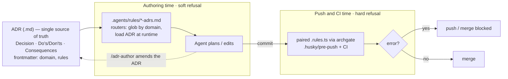

<div align="center">

# 🛠️ lean-harness-ai-sdlc

### LEAN & harness-powered AI Software Development Lifecycle

A batteries-included **framework of skills, rules, hooks and pipelines** for
shipping software with AI agents — plus a runnable TypeScript demo that the
harness lints, tests, scans and ships on every change.

<br />

[](https://github.com/stefanstelzer/lean-harness-ai-sdlc/actions/workflows/ci.yml)
[](https://codecov.io/gh/stefanstelzer/lean-harness-ai-sdlc)

[](./LICENSE)
[](./CONTRIBUTING.md)
[](https://conventionalcommits.org)
[](https://prettier.io)
[](./.nvmrc)
[](https://aquasecurity.github.io/trivy/)
[](https://archgate.dev)
[](https://claude.com/claude-code)

[](https://github.com/stefanstelzer/lean-harness-ai-sdlc/commits/main)
[](https://github.com/stefanstelzer/lean-harness-ai-sdlc/issues)
[](https://github.com/stefanstelzer/lean-harness-ai-sdlc/stargazers)

[Workflow](./WORKFLOW.md) · [Agent rules](./AGENTS.md) · [Methodology](./docs/methodology.md) · [Docs](./docs/README.md) · [Contributing](./CONTRIBUTING.md) · [ADRs](./.archgate/adrs/)

</div>

---

## What is this?

`lean-harness-ai-sdlc` is an opinionated **operating model for building software
with AI agents**. It pairs two ideas:

- **LEAN** — maximize the work _not_ done, build quality in, deliver fast in
  small batches, and keep a tight feedback loop.
- **Harness** — a concrete set of _skills_, _rules_ (ADRs & `AGENTS.md`), _hooks_
  (git + CI gates) and _pipelines_ that keep agents on the rails so velocity
  never costs you correctness or architecture.

Three flows cover the bulk of day-to-day work — **Feature**, **Bug** and
**Change-Request** — each running the same delivery spine from intent to merged
PR (`Agent → Artefact → Commit → Hooks → Push → PR`). The harness is
**human-in-the-loop and non-subagentic** by design: a human drives and reviews
every stage. See [WORKFLOW.md](./WORKFLOW.md).

> The methodology _is_ the product. The TypeScript package under `src/` is the
> dogfood: a tiny feature-flag library the harness uses to prove every gate
> actually runs and stays green.

The harness doesn't just list rules — it **guides how agents implement**:

- **Rules wired to ADRs** — agents plan and edit against the ADRs in `.archgate/adrs/`.
  The `*-adrs` router rules load them at runtime, so an agent _refuses_ a change that would
  break an invariant (soft refusal), and archgate re-checks it mechanically on push and in CI
  (hard refusal). See [Architecture governance](#architecture-governance).
- **Tracer-bullet first** — `/prd-to-plan` orders work **risk-first** into deep-module phases;
  **Phase 1 is the tracer bullet**, the riskiest module that proves the hardest path
  end-to-end before the rest follow.
- **Red → green → refactor** — `/tdd` builds every change test-first in **vertical slices**.
  This loop is the binding template for _all_ code (Feature **and** Bug flows), enforced by
  `GEN-004` (every `src/` module needs a matching test).

## Repository layout

```text
.
├── .agents/                 # tool-agnostic single source of truth for the harness
│   ├── skills/<name>/        #   12 agent skills (SKILL.md + sub-docs)
│   └── rules/<name>.md        #   workspace rules (ADR routers + style)
├── .claude/                 # per-tool view of the harness
│   ├── skills/<name>  ───────►  symlink → ../../.agents/skills/<name>
│   ├── rules/<name>.md ──────►  symlink → ../../.agents/rules/<name>.md
│   └── agent-memory/          #   durable learnings written by /lessons-learned
├── .archgate/               # architecture governance
│   ├── adrs/                  #   ADRs (<ID>-<slug>.md + <ID>-<slug>.rules.ts)
│   ├── lint/                  #   archgate lint helpers
│   └── rules.d.ts             #   generated rule type defs
├── scripts/                 # symlink checks, archgate-ci, semver-floor, trivy
├── src/                     # demo TypeScript library (the dogfood)
│   ├── index.ts              #   public surface — re-exports only (ARCH-001)
│   ├── feature-flags.ts      #   implementation
│   └── types.ts              #   lowest layer — no internal imports
├── tests/                   # unit / smoke / e2e suites (Vitest)
├── prd/                     # PRDs written by /discovery (PRD-<n>-<slug>.md)
├── plans/                   # plans written by /prd-to-plan (PLN-<n>-<slug>.md)
├── docs/                    # methodology, docs index, source layout
├── .husky/                  # commit-msg + pre-push git hooks
├── .github/                 # CI workflows, rulesets, issue/PR templates
├── skills-lock.json         # lockfile for externally-vendored skills
├── AGENTS.md                # rules every agent must follow (read first)
├── WORKFLOW.md              # the three flows in detail
└── README.md                # you are here
```

Skills and rules have a **single source of truth** under `.agents/`; `.claude/`
holds only symlinks into it, so every agent tool sees the same set with no copy
drift. `scripts/check-skill-symlinks.sh` and `scripts/check-rule-symlinks.sh`
(`npm run check:links`) enforce this in the pre-push hook and CI.

## Skills

The 12 skills live under [`.agents/skills/`](./.agents/skills/) and are invoked
as `/goal`, `/tdd`, etc.

| Skill                    | Flow station      | Purpose                                                                                        |
| ------------------------ | ----------------- | ---------------------------------------------------------------------------------------------- |
| `/discovery`             | Feature front     | Explore the problem, frame scope, write `prd/PRD-<n>-<slug>.md`                                |
| `/goal`                  | Bug / CR front    | Sharpen a request or defect into a testable goal statement                                     |
| `/grill-me-with-context` | PRD / Plan review | Pressure-test a PRD/plan against the codebase + ADRs                                           |
| `/prd-to-plan`           | Plan              | Decompose an approved PRD **risk-first** into deep-module phases; Phase 1 = **tracer bullet**  |
| `/tdd`                   | Agent / Artefact  | Implement test-first in **vertical slices** (**red → green → refactor**); lands the spec first |
| `/bug-analysis`          | Bug investigation | Reproduce, isolate root cause, write a failing test first                                      |
| `/reviewer`              | Commit (archgate) | Gate the diff on correctness, architecture, tests                                              |
| `/pr`                    | Commit → PR       | Commit, push, open the PR with `--fill-verbose`, drive CI green                                |
| `/lessons-learned`       | Commit (archgate) | Feed retrospective insight back into ADRs / agent-memory                                       |
| `/adr-author`            | PRD review        | Write/amend ADRs in `.archgate/adrs/` (+ optional rules)                                       |
| `/write-better-skill`    | Meta              | How to author skills for this harness (frontmatter, patterns)                                  |
| `/decide-semver`         | Release           | Read the diff since last tag and may raise the semver floor                                    |

## Install as a plugin

The 12 skills ship to three agent tools from one canonical source (`.agents/`).
See [`docs/distribution.md`](./docs/distribution.md) for the full model.

The skills: `discovery`, `goal`, `grill-me-with-context`, `prd-to-plan`, `tdd`,
`bug-analysis`, `reviewer`, `pr`, `lessons-learned`, `adr-author`,
`write-better-skill`, `decide-semver`.

### Claude Code

```text
/plugin marketplace add stefanstelzer/lean-harness-ai-sdlc
/plugin install lean-harness@lean-harness
```

Skills appear as `/lean-harness:<skill>`. Run `/lean-harness:init-harness` to
scaffold the full harness (canonical `.agents/`, archgate ADRs, CI, git hooks)
into a repo.

### Gemini CLI

```bash
gemini extensions install https://github.com/stefanstelzer/lean-harness-ai-sdlc
```

Commands appear as `/lean:<skill>` (e.g. `/lean:tdd`); harness context comes from
`GEMINI.md`.

### Antigravity

Clone or use this repo as a workspace template — Antigravity reads
`.agents/skills/` and `AGENTS.md` natively, no packaging required. Add any MCP
servers via `~/.gemini/config/mcp_config.json` if needed.

## Architecture governance

This harness's architecture gate is powered by
**[archgate](https://archgate.dev)** — an external, open-source (Apache-2.0) CLI
that enforces your architecture and coding rules as executable guardrails. It is
the engine behind the `.archgate/` directory and every `archgate` command in this
repo, and it runs on demand through `npx -y archgate`, so there is nothing to
install separately (see [Prerequisites](#prerequisites) and the
[archgate CLI reference](https://cli.archgate.dev/)).

Architecture Decision Records (ADRs) live in
[`.archgate/adrs/`](./.archgate/adrs/) and are enforced by archgate on every push
and in CI. Each ADR is a `<ID>-<slug>.md` (with YAML frontmatter: `id`, `title`,
`status`, `domain`, `rules`) usually paired with an executable
`<ID>-<slug>.rules.ts`.

Enforcement runs in two phases that share the same source of truth:

- **Authoring time — soft refusal.** The `*-adrs` agent rules (`.agents/rules/`) are thin
  routers: they glob `.archgate/adrs/*.md`, keep the ones matching their `domain:`, and load
  the ADR text **at runtime** (never duplicating it). An agent about to break a `Decision` or
  Do's-and-Don'ts bullet refuses, cites the ADR id, and offers to reformulate or amend the ADR
  via `/adr-author`.
- **Push & CI time — hard refusal.** The paired `<ID>-<slug>.rules.ts` run under archgate
  (`scripts/archgate-ci.mjs`) in `.husky/pre-push` and in CI. An `error`-severity violation
  (e.g. `arch001/index-only-reexports`) blocks the push and the merge; warnings
  (e.g. `gen004/src-module-has-test`) stay visible.



```bash
npm run archgate                 # run ADR compliance checks (also in pre-push + CI)
npx -y archgate adr list         # list all ADRs
npx -y archgate check --adr GEN-003   # check a specific ADR
```

| Domain                  | ADRs                                                                                                                                                                                                                                                            |
| :---------------------- | :-------------------------------------------------------------------------------------------------------------------------------------------------------------------------------------------------------------------------------------------------------------- |
| **Architecture** (ARCH) | `ARCH-001` Layered source architecture (`index.ts` re-exports only; `types` ← impl ← `index` layering)                                                                                                                                                          |
| **General** (GEN)       | `GEN-001` Conventional Commits · `GEN-002` E2E tests in CI · `GEN-003` TypeScript strict · `GEN-004` TDD discipline · `GEN-005` Vitest unit tests · `GEN-006` Manual Test Plan required · `GEN-007` Versioning & release · `GEN-008` Generated plugin artefacts |

`GEN-006` has no executable rule — it is a manual gate enforced via the PR
template. New boundaries require a new ADR; author it with `/adr-author`.

## Versioning & release

Conventional Commits (`GEN-001`) drive versioning, but releases are cut
**manually** — there is no release pipeline. When it's time to ship, a maintainer:

1. computes a **deterministic semver floor** from the commits since the last
   `v*` tag (`scripts/semver-floor.mjs`): `fix:` → patch, `feat:` → minor,
   `<type>!:` / `BREAKING CHANGE` → major;
2. optionally runs `/decide-semver`, which may **raise** — never lower — the floor;
3. bumps `package.json`, updates `CHANGELOG.md`, tags `vX.Y.Z`, and lands it via a
   normal PR. No machine commits to `main` (see `GEN-007`).

`skills-lock.json` (`{ "version": 1, "skills": {} }`) is the lockfile for any
externally-vendored skills. All skills here are authored locally, so it is empty;
the mechanism is present for the future.

## Quickstart

### Prerequisites

- **Node.js ≥ 20** and npm — see [`.nvmrc`](./.nvmrc); run `nvm use`.
- **[archgate](https://archgate.dev)** — the external CLI that powers this
  harness's architecture governance: the `.archgate/` rules, the
  `npm run archgate` gate, and the ADR enforcement in the pre-push hook and CI.
  It is **not** a bundled npm dependency — every `archgate` script invokes it
  through `npx -y archgate`, which downloads it on first use, so there is nothing
  to install by hand. To pin a version or install it globally, follow the
  [archgate CLI docs](https://cli.archgate.dev/).

### Setup

```bash
# 1. Use the right Node (see .nvmrc)
nvm use

# 2. Install deps and wire up git hooks
npm install            # runs "prepare" → installs husky hooks

# 3. Run the local gate (what pre-push enforces)
npm run verify         # lint + typecheck + symlink checks + archgate + tests

# Individual gates
npm run lint
npm run typecheck      # tsc --noEmit (Vitest/esbuild does not type-check) — GEN-003
npm run check:links    # skill + rule symlink invariants
npm run archgate       # architecture-fitness check (see .archgate/adrs/)
npm test               # unit + smoke + e2e
npm run test:coverage
```

### Try the demo library

```ts
import { FeatureFlags } from 'lean-harness-ai-sdlc';

const flags = new FeatureFlags([
  { key: 'new-checkout', enabled: true, rollout: 25 }, // 25% canary
]);

flags.isEnabled('new-checkout', { userId: 'user-42' }); // deterministic per user
```

A flag can also declare **prerequisites** — it evaluates `true` only when it is
itself enabled _and_ every prerequisite is enabled for the same context.
Prerequisites resolve transitively and honour rollout; unknown keys fail closed,
and cycles are rejected at registration time.

```ts
const flags = new FeatureFlags([
  { key: 'new-checkout', enabled: true, rollout: 100 },
  { key: 'checkout-upsell', enabled: true, requires: ['new-checkout'] },
]);

flags.isEnabled('checkout-upsell', { userId: 'user-42' }); // true only while new-checkout is too
```

**Per-user targeting overrides** pin specific users independently of the
percentage: ids on `allowUsers` always pass the rollout gate (dogfooders, beta
customers), ids on `denyUsers` never see the flag (a tenant that hit a bug).
Deny wins over allow; `enabled: false` and `requires` still apply, and
evaluations without a `userId` ignore both lists.

```ts
const flags = new FeatureFlags([
  {
    key: 'new-checkout',
    enabled: true,
    rollout: 5,
    allowUsers: ['beta-42'],
    denyUsers: ['tenant-9'],
  },
]);

flags.isEnabled('new-checkout', { userId: 'beta-42' }); // true — forced in at 5%
flags.isEnabled('new-checkout', { userId: 'tenant-9' }); // false — forced out
```

## Use this repo as a template

1. Copy `.agents/`, `.claude/` (with its symlinks), `.archgate/`, `.husky/`,
   `scripts/`, `.github/`, `AGENTS.md` and `WORKFLOW.md` into your project.
2. Wire the gates into your `package.json` scripts and `.github/workflows/`.
3. Point the badges and links at your own `owner/repo` slug.
4. Replace the `src/` demo library with your code; keep the ADR set (adapt the
   `*.rules.ts` to your structure) so the archgate stays meaningful.
5. Start every change at `/discovery` (feature), `/bug-analysis` (bug) or
   `/goal` (change request) and follow the flow to a green PR.

## Contributing

Contributions are welcome — please read [CONTRIBUTING.md](./CONTRIBUTING.md) and
our [Code of Conduct](./CODE_OF_CONDUCT.md). Security issues: see
[SECURITY.md](./SECURITY.md).

## License

[Apache-2.0](./LICENSE) © Stefan Stelzer
