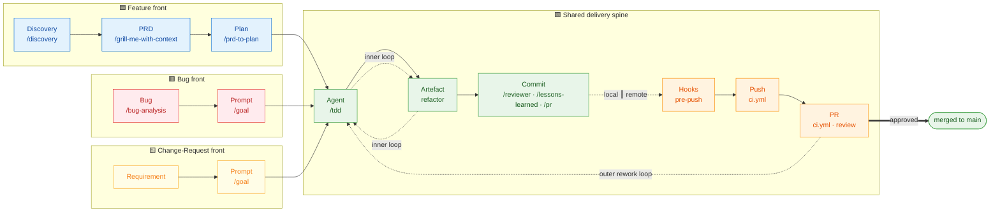
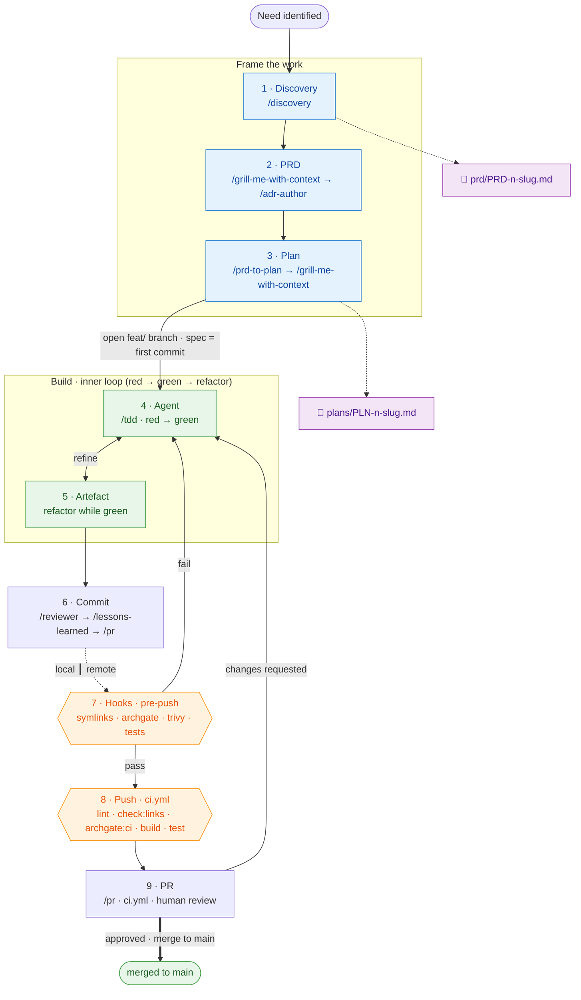
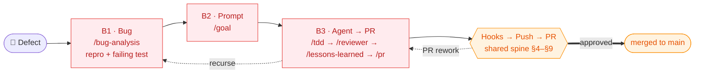
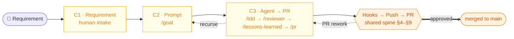
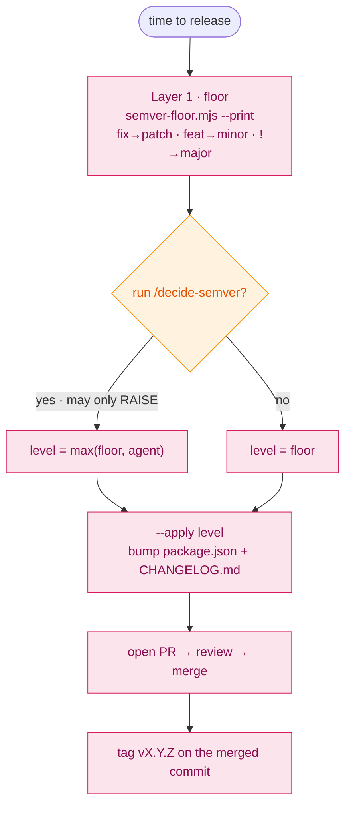

# Development Workflow

This document describes the recommended **human-in-the-loop (HITL),
non-subagentic** workflow for delivering changes in this repository. A human
drives and reviews every stage; skills assist, but no autonomous subagent owns a
stage end-to-end.

There are three entry points — **Feature**, **Bug**, and **Change-Request** —
that all converge on the same delivery **spine**:

```
Agent → Artefact → Commit ┃ Hooks → Push → PR
```

The `┃` marks the **local/remote boundary**: everything up to and including
Commit happens on the developer's machine; from the pre-push hook onward the work
crosses into shared CI. Two iteration loops keep the work honest:

- **Inner loop** `Agent ⇄ Artefact ⇄ Commit` — implement, test, refine until the
  slice is green.
- **Outer loop** `PR → Agent` — review feedback re-enters implementation.

## Overview



> The same diagram as a presentation deck lives in
> [`docs/assets/ai_sdlc.pdf`](docs/assets/ai_sdlc.pdf); rendered per-flow boards
> are in [`docs/assets/`](docs/assets/) (`flow-feature.png`, `flow-bug.png`,
> `flow-change-request.png`). This document is authoritative.

## The lanes

Every phase is described across the same lanes:

| Lane          | Meaning                                                                 |
| ------------- | ---------------------------------------------------------------------- |
| **Phase**     | The step in the flow (left → right).                                   |
| **Skills**    | The skill that assists the phase (`.agents/skills/<name>/`, run as `/<name>`). |
| **Key ADRs**  | Binding constraints — the ADRs in `.archgate/adrs/`, routed via `.agents/rules/*-adrs.md`. |
| **Documents** | Project docs that inform or are updated in the phase.                  |
| **Tests**     | The automated tests that run.                                         |
| **Pipeline**  | The CI/hook stage that gates the phase.                                |
| **Git**       | The git action (branch, pre-push, push).                              |

> **Hard vs. soft enforcement.** The Key-ADRs column lists the constraints that
> bind each phase, but not every ADR clause is machine-checked. archgate and the CI
> gates verify structure and presence; the rest rests on the soft `*-adrs` routing
> plus human review. See [`docs/enforcement-coverage.md`](docs/enforcement-coverage.md)
> for the per-ADR map of what is hard-enforced vs. prompt-only.

## Feature flow

The Feature flow is the full flow; Bug and Change-Request are documented as
variants below. `/pr` spans **Commit → Hooks → Push → PR** (it commits, pushes,
opens the PR, and drives CI green).



| #   | Phase     | Skills                                                  | Key ADRs                                  | Documents                          | Tests                          | Pipeline                  | Git                                  |
| --- | --------- | ------------------------------------------------------ | ----------------------------------------- | ---------------------------------- | ------------------------------ | ------------------------- | ------------------------------------ |
| 1   | Discovery | `/discovery`                                           | `*-adrs` (read); English-only             | writes `prd/PRD-<n>-<slug>.md`     | —                              | —                         | —                                    |
| 2   | PRD       | `/grill-me-with-context` → `/adr-author`               | all `*-adrs`                              | `AGENTS.md`, `WORKFLOW.md`, `README.md` | —                          | —                         | —                                    |
| 3   | Plan      | `/prd-to-plan`, then `/grill-me-with-context`          | `*-adrs`; `GEN-006` per phase             | writes `plans/PLN-<n>-<slug>.md`   | —                              | —                         | —                                    |
| 4   | Agent     | `/tdd` (red → green)                                    | `GEN-004`, `GEN-005`, `GEN-003`, `ARCH-001` | PRD + plan                        | **Unit** (`tests/unit/`)       | —                         | opens `feat/<slug>`; **spec = first commit** |
| 5   | Artefact  | `/tdd` (refactor while green)                           | `ARCH-001`, area ADRs                      | updated docs                       | Unit                           | —                         | —                                    |
| 6   | Commit    | `/reviewer` → `/lessons-learned` → `/pr` (commit)      | archgate = all ADRs; `GEN-001`            | ADRs / agent-memory                | Unit                           | local archgate            | Conventional-Commits commit          |
| 7   | Hooks     | `/pr` (push fires the hook)                             | symlink invariants, archgate, `GEN-005`   | —                                  | Unit · Smoke                   | `.husky/pre-push`         | pre-push gate                        |
| 8   | Push      | `/pr`                                                   | `GEN-005`                                  | —                                  | Unit · Smoke (`tests/smoke/`)  | `ci.yml`                  | branch pushed                        |
| 9   | PR        | `/pr` + human review                                    | `AGENTS.md` PR Descriptions, `GEN-006`     | PR body (Summary/Commits/Manual Test Plan) | — (e2e run on demand, `GEN-002`) | `ci.yml`                | PR opened, merged on green           |

Support skills outside the loop: `/write-better-skill` (when authoring skills),
`/adr-author` (invoked by `/grill-me-with-context` to write decisions back as
ADRs), and `/decide-semver` (a manual release helper, see Versioning).

### 1. Discovery

- **Goal:** Frame the problem and gather requirements before any solution shape.
- **Human:** Requirements engineering — clarify the need, scope, and constraints.
- **Skill:** `/discovery` — explores the problem space, finds test seams, and
  writes a PRD to `prd/PRD-<n>-<slug>.md`.
- **Done when:** The problem, scope, and success criteria are written down and
  agreed.

### 2. PRD

- **Goal:** Turn discovery into a Product Requirements Document.
- **Skill:** `/grill-me-with-context` — adversarially pressure-test the PRD
  against the codebase and the ADRs; invoke `/adr-author` to record any
  architectural decision back as an ADR before acceptance.
- **Documents:** `AGENTS.md`, `WORKFLOW.md`, `README.md` are the context the PRD
  must stay consistent with.
- **Done when:** The PRD survives the grilling and the human approves it.

### 3. Plan

- **Goal:** Derive an executable implementation plan from the approved PRD.
- **Skills:** `/prd-to-plan` (generate the plan into `plans/PLN-<n>-<slug>.md`),
  then `/grill-me-with-context` (pressure-test it).
- **Done when:** The plan is reviewed, grilled, and approved.

### 4. Agent (implement)

- **Goal:** Implement the plan on a feature branch.
- **Skill:** `/tdd` — write the failing test first, then minimal implementation
  (red → green), in vertical slices.
- **Tests:** **Unit tests** run continuously while implementing (`npm run test:unit`).
- **Git:** `/tdd` **opens the feature branch off `main`** and lands the PRD +
  plan as its **first commit** before any production code (never commit to `main`
  — see `AGENTS.md` › Branch Policy).
- **Loop:** Iterates with **Artefact** and **Commit** until the slice is green.

### 5. Artefact

- **Goal:** The concrete output — code, tests, and any updated docs.
- **Human:** **Refactoring** — tidy the artefact for clarity and reuse (while the
  suite stays green) before it is committed.
- **Loop:** Feeds back into **Agent** as needed.

### 6. Commit

- **Goal:** Record a coherent, reviewed change locally.
- **Skills (in order):** `/reviewer` — local [archgate](https://archgate.dev) (the
  external architecture-governance CLI) review of the diff;
  `/lessons-learned` — capture learnings into `.claude/agent-memory/` and/or ADRs;
  **then** `/pr` commits the work (Conventional Commits). `/pr` always runs after
  `/reviewer` and `/lessons-learned`.
- **Boundary:** This is the last local step before the work crosses into CI.
- **Done when:** The diff passes the local reviewer, learnings are captured, and
  the change is committed with a Conventional-Commits message.

### 7. Hooks (pre-push)

- **Goal:** Gate the push locally before it reaches CI.
- **Pipeline / Git:** `/pr`'s push fires the Husky **pre-push** hook
  (`.husky/pre-push`), which runs, in order: skill & rule symlink checks →
  **plugin artefact sync** (`check:plugins`) → **Archgate** compliance
  (`scripts/archgate-ci.mjs`) → **Trivy** security scan → **typecheck**
  (`tsc --noEmit`, `GEN-003` — Vitest/esbuild does not type-check) → **unit + smoke
  tests** (`npm run test:unit && npm run test:smoke`, mirroring CI — e2e is run on
  demand, not gated here, per `GEN-002`). It aborts on the first failure.
- **Done when:** Every pre-push gate is green; otherwise the push is aborted.

### 8. Push

- **Goal:** Publish the branch and run the shared pipeline.
- **Skill:** `/pr` pushes the branch.
- **Pipeline:** **CI pipeline** ([`ci.yml`](.github/workflows/ci.yml)) — the single
  workflow, triggered on push and pull_request:
  install → lint → check:links → check:plugins → archgate:ci → trivy → build → test.
- **Tests:** Unit + smoke suites under Vitest (e2e is run on demand, not in CI —
  see `GEN-002`).
- **Done when:** The CI pipeline is green.

### 9. PR

- **Goal:** Get the change reviewed and merged.
- **Skill:** `/pr` — opens the PR (`AGENTS.md` › PR Descriptions) and watches the
  run, fixing **root causes** until every required check is green. It invokes
  `/lessons-learned` along the way.
- **Human:** **Review** — the human reviews the PR; feedback loops back to
  **Agent** (outer rework loop).
- **Pipeline:** **CI pipeline** ([`ci.yml`](.github/workflows/ci.yml)) — the same
  single workflow that ran on push produces the required `Verify` check on the PR.
  The **e2e** suite (`tests/e2e/`, `GEN-002`) is **not** run in CI; run it on
  demand (`npm run test:e2e`).
- **Constraints:** The PR body MUST follow `AGENTS.md` › PR Descriptions and the
  `GEN-006` Manual Test Plan rule.
- **Done when:** Reviewed, all required checks green, and merged. Cutting a version
  afterwards is a manual step (see Versioning).

## Variants

The Bug and Change-Request flows reuse the **same delivery spine** as the Feature
flow — from **Agent** onward they are identical to §4–§9 (implement with `/tdd`
on a branch, refine the artefact, commit behind `/reviewer` + `/lessons-learned`,
then pre-push hook → push pipeline → PR review). They differ only in the **front
phases**: instead of Feature's `Discovery → PRD → Plan`, each has a lighter
intake followed by a single **Prompt** phase, the right shape for work that does
not need a full PRD and plan.

### Bug



| #   | Phase      | Skills                                                | Key ADRs                                            |
| --- | ---------- | ----------------------------------------------------- | --------------------------------------------------- |
| B1  | Bug        | `/bug-analysis`                                       | `*-adrs` (read)                                     |
| B2  | Prompt     | `/goal`                                               | `*-adrs`                                            |
| B3  | Agent → PR | `/tdd` → `/reviewer` + `/lessons-learned` → `/pr`     | same as Feature §4–§9 (`GEN-004`, `GEN-005`, `GEN-006`, Branch Policy, PR Descriptions) |

- **B1. Bug** — Reproduce and understand the defect before touching code.
  `/bug-analysis` confirms the symptom, isolates the trigger, finds the root
  cause, and captures a **failing test** that drives the fix in B3.
- **B2. Prompt** — Turn the analysis into a precise, scoped fix prompt with
  `/goal`, framing the fix tightly so it addresses the root cause without scope
  creep.
- **B3. Agent → PR** — Identical to the Feature delivery spine (§4 Agent → §9 PR):
  make the failing test pass with `/tdd`, refine, commit behind `/reviewer`, then
  pre-push → push → PR (with the `GEN-006` Manual Test Plan). The `PR → Agent`
  rework loop applies.

### Change-Request



| #   | Phase       | Skills                                              | Key ADRs                  |
| --- | ----------- | -------------------------------------------------- | ------------------------- |
| C1  | Requirement | _(human intake — no skill)_                        | `*-adrs` (read)           |
| C2  | Prompt      | `/goal`                                            | `*-adrs`                  |
| C3  | Agent → PR  | `/tdd` → `/reviewer` + `/lessons-learned` → `/pr`  | same as Feature §4–§9     |

- **C1. Requirement** — Capture the requested change to existing behavior:
  clarify what should change, the acceptance criteria, and the blast radius.
- **C2. Prompt** — Turn the requirement into a precise, scoped implementation
  prompt with `/goal`.
- **C3. Agent → PR** — Identical to the Feature delivery spine (§4 Agent → §9 PR).

The Bug and Change-Request fronts differ only in intake: Bug starts from a defect
(**investigation** + `/bug-analysis`) to diagnose *existing, unintended*
behavior; Change-Request starts from a **requirement** to specify *new or changed
intended* behavior. Both funnel through the single **Prompt** phase (`/goal`) and
join the shared spine at **Agent**.

## Versioning & release

Releases are cut **manually** — there is no release pipeline. When it is time to
ship, a maintainer decides the bump in two layers, then lands it through the
normal branch → PR → merge flow:

1. A **deterministic Conventional-Commits floor** (`scripts/semver-floor.mjs`):
   `fix:` → patch, `feat:` → minor, `<type>!:` / `BREAKING CHANGE` → major.
2. An **optional agent refinement** — run `/decide-semver`, which reads the actual
   diff and may **raise** the bump (never lower it); take `max(floor, agent)`.
   Skip it and the deterministic floor stands alone.

Then bump `package.json`, update `CHANGELOG.md`, open the change as a PR like any
other, and tag `vX.Y.Z` on the merged commit. **No machine commits to `main`**
(see `AGENTS.md` › Branch Policy and `GEN-007`).


