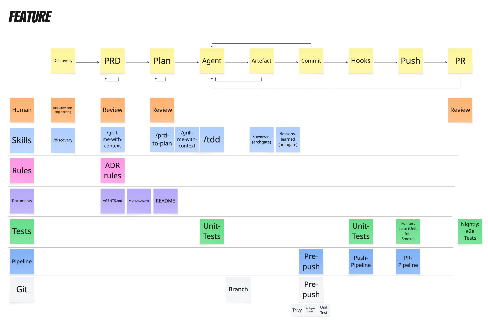
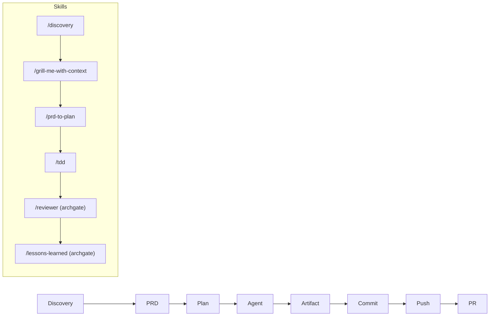
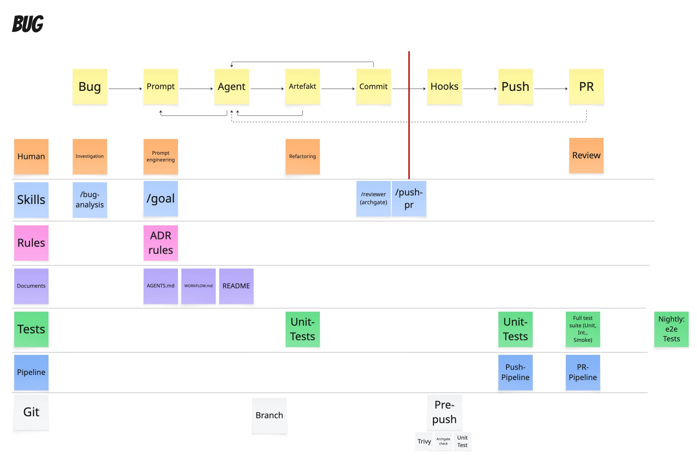
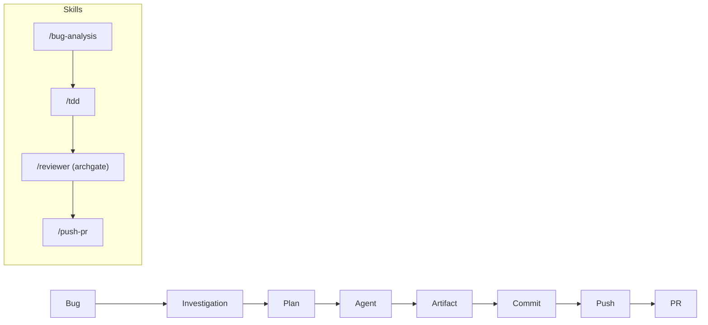
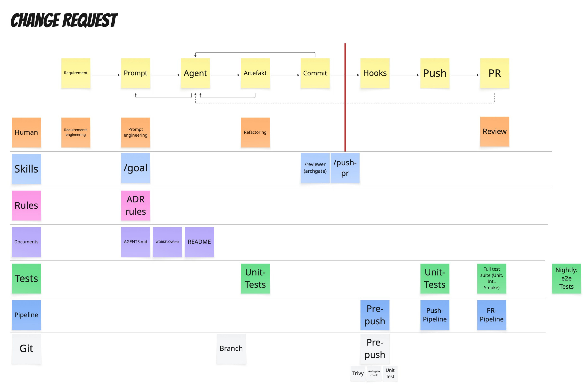
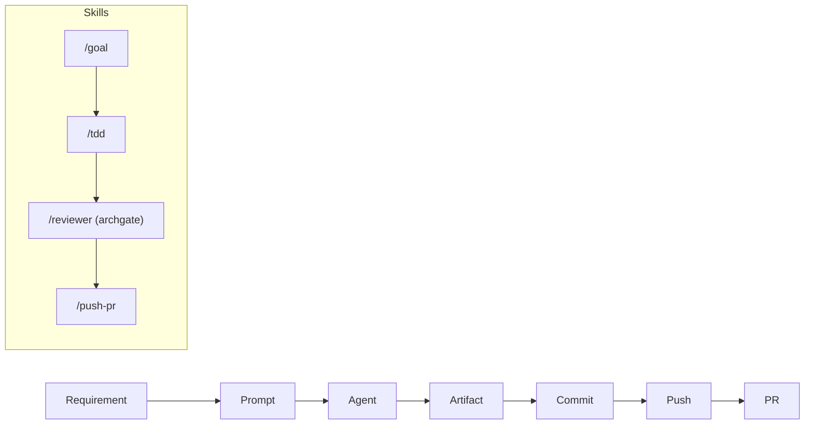

# Workflow

This project runs on three flows that share the same stations from intent to a
merged pull request. Each flow moves left-to-right across the same lanes:

```text
Requirement/Bug/Discovery → Prompt/PRD → Plan → Agent → Artifact → Commit
                                                                    ║ Hooks
                                                                    ↓
                                                          Push → PR → Merge
```

### The lanes

| Lane          | What happens                                                                       |
| ------------- | ---------------------------------------------------------------------------------- |
| **Human**     | Requirements engineering, prompt engineering, refactoring, review.                 |
| **Skills**    | Slash commands that drive each station (`/goal`, `/tdd`, `/reviewer`, …).          |
| **Rules**     | ADRs (`docs/adr/`) and `AGENTS.md` constrain how agents work.                      |
| **Documents** | `AGENTS.md`, `WORKFLOW.md`, `README.md` keep humans and agents aligned.            |
| **Tests**     | Unit tests per change; full suite (unit + integration + smoke) on PR; nightly e2e. |
| **Pipeline**  | Pre-push (local) → Push pipeline → PR pipeline.                                    |
| **Git**       | Branch → pre-push hook (Archgate + Trivy + unit) → push.                           |

The original swimlane diagrams are in [`docs/assets/`](./docs/assets/)
(`flow-change-request.png`, `flow-bug.png`, `flow-feature.png`).

---

## 1. Feature flow

The full flow, used when building something new. Discovery and review gates make
it the most thorough of the three.





**Stations**

1. **Discovery** (`/discovery`) — explore the problem before solutioning.
2. **PRD** (`/grill-me-with-context` → `/prd-to-plan`) — capture context, then a plan.
3. **Plan → Agent → Artifact** (`/tdd`) — implement in red-green-refactor cycles.
4. **Commit** — Conventional Commits; the `commit-msg` hook enforces the format.
5. **Review** (`/reviewer`, then `/lessons-learned`) — archgate the diff; feed
   insight back into rules/ADRs/skills.
6. **Push → PR** (`/push-pr`) — pre-push gate runs, then the PR pipeline runs the
   full suite.

## 2. Bug flow

Optimized for a fast, disciplined fix with a regression guard.





**Stations**

1. **Investigation** (`/bug-analysis`) — reproduce, isolate root cause, and write
   a **failing test** before any fix.
2. **Plan → Agent → Artifact** (`/tdd`) — minimal change to turn the test green.
3. **Commit → Review → Push → PR** — same gates as the feature flow.

> The Bug flow's pre-push lane additionally emphasises the **Trivy** scan, since
> fixes often touch dependencies and inputs.

## 3. Change Request flow

For scoped, well-understood changes that don't need full discovery.





**Stations**

1. **Requirement** (`/goal`) — turn the request into a sharp, testable goal.
2. **Prompt → Agent → Artifact** (`/tdd`) — implement against the acceptance criteria.
3. **Commit → Review → Push → PR** — same gates as the other flows.

---

## Gates (the same for every flow)

### `commit-msg` hook

Validates Conventional Commits via commitlint
([`commitlint.config.cjs`](./commitlint.config.cjs)).

### `pre-push` hook

Runs, in order, fail-fast ([`.husky/pre-push`](./.husky/pre-push)):

1. **Archgate** — `npm run archgate` enforces ADR layering rules.
2. **Trivy** — `scripts/run-trivy.sh` scans for vulns & secrets (soft-fail
   locally if Trivy isn't installed; hard-fail in CI).
3. **Unit tests** — `npm run test:unit`.

### Push pipeline

On every push: install → lint → unit tests
([`.github/workflows/push-pipeline.yml`](./.github/workflows/push-pipeline.yml)).

### PR pipeline

On every PR: full suite (unit + smoke/integration) + Trivy + archgate + coverage
([`.github/workflows/pr-pipeline.yml`](./.github/workflows/pr-pipeline.yml)).

### Nightly

Scheduled end-to-end suite
([`.github/workflows/nightly-e2e.yml`](./.github/workflows/nightly-e2e.yml)).
